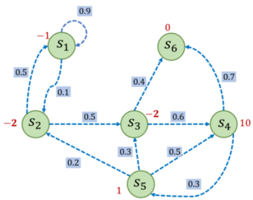
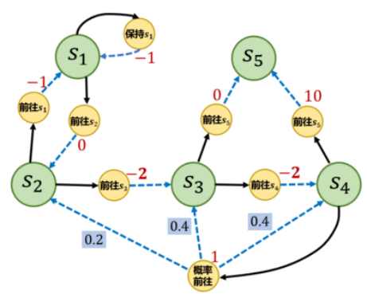

# 马尔可夫决策过程
马尔科夫决策过程抱恨状态信息以及状态之间的转移机制。
如果要用强化学习去解决一个实际问题，首先要将实际问题抽象成一个马尔科夫决策过程。

## 马尔可夫过程
### 随机过程
随机过程的研究对象是**随时间变化的**随机现象，或称**动态随机变量**，例如天气随时间的变化。
随机过程是对现实生活中动态随机现象的**建模**

在随机过程中，随机现象在某时刻$t$的取值是一个向量随机变量，用$S_t$表示，称为随机现象在$t$时刻的状态。所有可能的状态组成该随机现象的的状态集合$S$。
在某时刻$t$的状态$S_t$往往取决于之前时刻的状态$S_\tau$，则$S_{t+1}$的概率表述为：$P(S_{t+1}|S_1, S_2, ..., S_t)$

从状态$S_t$到状态$S_{t+1}$的演变就是一个动态随机现象
也就是说：**随机现象是状态的变化过程**
与静态随机现象不同，动态随机现象描述的是**在一个时序上，从某一状态到另一个状态的演变**，或是由时间序列串起来的状态序列；而静态随机现象描述的则是**某一状态的发生**。

**综上所述，取决于此前状态的条件概率$P(S_{t+1}|S_1, S_2, ..., S_t)$正是随机过程模型的核心。**


### 马尔可夫性质
当且仅当**某时刻的状态只取决于上一时刻的状态**时，一个随机过程被称为具有马尔可夫性质。用公式表述如下：
$$P(S_{t+1}|S_t) = P(S_{t+1}|S_t, ..., S_1)$$
马尔可夫性质可以大幅化简计算，各个时刻的状态链式相连。

### 马尔可夫过程
具有马尔可夫性质的随机过程称为马尔可夫过程，又称马尔可夫链。
通常使用一个元组$<S,P>$来描述马尔可夫过程，其中$S$是有限数量的状态集合，$P$是状态转移矩阵。

假设有n个状态，$S = \{s_1, s_2, ..., s_n\}$则：
$$P = \begin{bmatrix}P(s_1|s_1) &... &P(s_n|s_1) \\ \vdots &\ddots &\vdots \\ P(s_1|s_n) &... &P(s_n|s_n)\end{bmatrix}$$
描述每两个状态对之间的状态转移概率。
从某个状态出发，到达其他所有状态的概率之和为1，即P矩阵的每一行各元素之和为1。

#### 马尔可夫过程示例

> 其中每个绿色圆圈表示一个状态，每个状态都有一定概率（包括概率为0）转移到其他状态，其中$s_6$通常被称为**终止状态**（terminal state），因为它不会再转移到其他状态，可以理解为它永远以概率1转移到自己。状态之间的虚线箭头表示状态的转移，箭头旁的数字表示该状态转移发生的概率。从每个状态出发转移到其他状态的概率总和为1。例如，$s_1$有90%概率保持不变，有 10%概率转移到$s_2$，而在$s_2$又有50%概率回到$s_1$，有50%概率转移到$s_3$。
> 对应的状态转移矩阵如下：
> $$P = \begin{bmatrix} 0.9 &0.1 &0 &0 &0 &0 \\ 0.5 &0 &0.5 &0 &0 &0 \\ 0 &0 &0 &0.6 &0 &0.4 \\ 0 &0 &0 &0 &0.3 &0.7 \\ 0 &0.2 &0.3 &0.5 &0 &0 \\ 0 &0 &0 &0 &0 &1 \end{bmatrix}$$

给定一个马尔可夫过程，我们可以从某一个状态出发，通过状态转移矩阵生成一个到达终止状态的状态**序列**(episode)，这个生成序列的过程就叫**采样**(sampling)。

## 马尔可夫奖励过程
在马尔可夫过程的基础上加入奖励函数$r$和折扣因子$\gamma$，就得到了**马尔可夫奖励过程**
一个马尔可夫奖励过程可以由$<S,P,r,\gamma>$元组构成。
折扣因子$\gamma$描述未来的动作能得到的奖励对当前决策的影响。

### 回报
在一个马尔可夫奖励过程中中，从第$t$时刻的状态$S_t$开始，到达终止状态时，获得的所有奖励之和称为回报$G_t$
$$G_t = R_t + \gamma R_{t+1} + ... = \sum_{k=0}^{n}\gamma^{k}R_{t+k}$$
以下图的情况为例：

通过代码来计算回报：
```python
import numpy as np
np.random.seed(0)
# 定义状态转移概率矩阵P
P = [
    [0.9, 0.1, 0.0, 0.0, 0.0, 0.0],
    [0.5, 0.0, 0.5, 0.0, 0.0, 0.0],
    [0.0, 0.0, 0.0, 0.6, 0.0, 0.4],
    [0.0, 0.0, 0.0, 0.0, 0.3, 0.7],
    [0.0, 0.2, 0.3, 0.5, 0.0, 0.0],
    [0.0, 0.0, 0.0, 0.0, 0.0, 1.0],
]
P = np.array(P)

rewards = [-1, -2, -2, 10, 1, 0]  # 定义奖励函数
gamma = 0.5  # 定义折扣因子


# 给定一条序列,计算从某个索引（起始状态）开始到序列最后（终止状态）得到的回报
def compute_return(start_index, chain, gamma):
    G = 0
    for i in reversed(range(start_index, len(chain))):
        G = gamma * G + rewards[chain[i] - 1]
    return G


# 一个状态序列,s1-s2-s3-s6
chain = [1, 2, 3, 6]
start_index = 0
G = compute_return(start_index, chain, gamma)
print("根据本序列计算得到回报为：%s。" % G)
```

### 价值函数
在马尔可夫奖励过程中，从一个状态出发，获得的所有回报的期望称为这个状态的价值。
所有状态的价值构成了价值函数，函数的输入是状态，输出是该状态的价值。可以写作$V(s) = \mathbb{E}[G_t|S_t = s]$
> 类似于一个列表，输入索引即可得到对应的列表值。

$$\begin{align*} V(S_t) =& \mathbb{E}[G_t|S_t = s] \\ =& \mathbb{E}[R_t + \gamma R_{t+1} + ...|S_t = s] \\ =& \mathbb{E}[R_t + \gamma(R_{t+1} + \gamma R_{t+2} + ...)|S_t = s] \\ =& \mathbb{E}[R_t + \gamma G_{t+1}|S_t = s] \\ =& \mathbb{E}[R_t|S_t = s] + \gamma\mathbb{E}[G_{t+1}|S_t = s] \\ =& \mathbb{E}[R_t|S_t = s] + \gamma\mathbb{E}[\mathbb{E}[G_{t+1}|S_{t+1},S_t = s]|S_t = s] \\ =& \mathbb{E}[R_t + \gamma V(S_{t+1})|S_t = s] \end{align*}$$
> 期望是线性运算
> 全期望公式：对一个随机变量$X$，可以现在一个中间随机变量$Y$的条件下求期望，，再对$Y$求期望，其结果和直接求$X$的期望是一致的。因此可以做如下变形：
> $\mathbb{E}[G_{t+1}|S_t = s] = \mathbb{E}[\mathbb{E}[G_{t+1}|S_{t+1},S_t = s]|S_t = s]$
> 由马尔可夫过程中的马尔可夫性质，$t+1$时刻的回报$G_{t+1}$只依赖于$t+1$时刻的状态$S_{t+1}$，与$t$时刻的状态$S_{t}$无关，因此$\mathbb{E}[G_{t+1}|S_{t+1},S_t = s] = \mathbb{E}[G_{t+1}|S_{t+1}] = V(S_{t+1})$
> 若$S_{t+1} = s'$则$V(s')$是常数，而$V(S_{t+1})$本身是一个随机变量。

观察上式的最后一个等号，不难发现：
即时奖励的期望是奖励函数的输出$\mathbb{E}[R_t|S_t = s] = r(s)$
剩余部分可以几何状态转移函数，整理为从状态$S_t$出发的形式$\mathbb{E}[\gamma V(S_{t+1})|S_t = s] = \gamma \sum_{s' \in S}p(s'|s)r(s')$
即，
$$V(s) = r(s) + \gamma \sum_{s' \in S}p(s'|s)V(s')$$
该等式即是**贝尔曼方程**。若一个马尔可夫奖励过程一共有n个状态，则将状态、状态的价值和奖励函数写成列向量，得到贝尔曼方程的矩阵形式
$$\mathcal{V} = \mathcal{R} + \gamma\mathcal{P}\mathcal{V}$$
可以整理出对应的解析解为
$$\mathcal{V} = (I - \gamma\mathcal{P})^{-1}\mathcal{R}$$
通过解析解求解状态价值的计算复杂度是$O(n^3)$，因此只在很小的马尔科夫奖励过程中使用；求解较大的马尔科夫奖励过程中的价值函数时，通常使用**动态规划**算法、**蒙特卡洛**方法和**时序差分**。

通过代码实现价值函数的解析解计算：
```python
def compute(P, rewards, gamma, states_num):
    ''' 利用贝尔曼方程的矩阵形式计算解析解,states_num是MRP的状态数 '''
    rewards = np.array(rewards).reshape((-1, 1))  #将rewards写成列向量形式
    value = np.dot(np.linalg.inv(np.eye(states_num, states_num) - gamma * P),
                   rewards)
    return value


V = compute(P, rewards, gamma, 6)
print("MRP中每个状态价值分别为\n", V)
```

## 马尔可夫决策过程
与之前的马尔可夫过程和马尔可夫奖励过程不同，马尔可夫决策过程是由外界的“刺激”来改变的随机过程，而马尔可夫过程和马尔可夫奖励过程都是自发的随机过程。

将外界的“刺激”称为**智能体**的**动作**，在马尔可夫奖励过程的基础上加入动作，就得到了马尔可夫决策过程，由元组$<\mathcal{S}, \mathcal{A}, \mathcal{P}, r, \gamma>$构成。

MDP与MRP相比，在状态转移函数和奖励函数中都多了动作$a$作为自变量。
> 在MDP中，使用状态转移函数而非状态转移矩阵来描述状态的改变，因为此时状态的转变与动作也相关，不再是之前的二维矩阵而变成了三维数组。另外，对于非离散的情况，状态转移函数也比状态转移矩阵更具普世意义。

MDP与MRP最大的区别就在于：MDP中存在一个智能体来执行动作
智能体根据当前的状态$S_t$主动选择动作$A_t$;对与$<S_t,\quad A_t>$MDP根据建立函数和状态转移函数得到$S_{t+1}$和$R_t$并反馈给智能体，智能体的目标是最大化得到的累计奖励。
在这个过程中，智能体根据当前状态从动作的集合$\mathcal{A}$中选择一个动作的函数，称为**策略**。

### 策略
智能体的策略通常用字母$\pi$表示，
$$\pi(a|s) = P(A_t=a|S_t=s)$$
策略$\pi(a|s)$是一个函数，表示**输入状态$s$下，采取动作$a$的概率**。
策略通常分为**确定性策略**和**随机性策略**。
确定性策略：每个状态只输出一个确定的动作（概率为1），其他动作的概率为0；
随机性策略：在每个状态输出的是关于动作的概率分布，根据该分布采样得到一个动作。
> 由于马尔可夫性质的存在，策略只与当前状态有关，而不必考虑历史状态。

在MRP过程中的价值函数可以迁移到MDP中，此时的价值函数与策略相关。在同一个状态下下，由于选择的动作不同（策略不同），后续的$<S, A, r>$也不同，因此计算得到的状态价值也不同。

### 状态价值函数
用$V^{\pi}(s)$表示在MDP中基于策略的状态价值函数
**状态价值函数**：从状态$s$出发，遵循策略$\pi$能获得的期望回报
$$V^{\pi}(s) = \mathbb{E}[G_t|S_t = s]$$

### 动作价值函数
在MDP中，由于动作的存在，我们可以定义一个**动作价值函数**($Q^{\pi}(s,a)$)。
**动作价值函数**：MDP遵循策略$\pi$时，对当前状态$s$执行动作$a$得到的期望回报。
$$Q^{\pi}(s,a) = \mathbb{E}_{\pi}[G_t|S_t = s, A_t = a]$$

状态价值函数与动作价值函数之间的关系：
状态价值函数等于所有动作价值函数与对应动作的策略之积
$$V^{\pi}(s) = \sum_{a\in A}Q^{\pi}(s,a)$$
动作价值函数等于即时奖励加上衰减后的所有可能的下一状态的状态转移函数与对应状态价值之积
$$Q^{\pi}(s) = r(s,a) + \gamma \sum_{s'\in S}P(s'|s,a)V^{\pi}(s')$$

### **贝尔曼期望方程**
为了与贝尔曼最优方程进行区分，将原本价值函数的贝尔曼方程表述为贝尔曼期望方程。
$$\begin{align*}V^{\pi}(s) =& \mathbb{E}_{\pi}[R_t + \gamma V^{\pi}(S_{t+1})|S_t = s] \\ =& \sum_{a\in A}\pi(a|s)(r(s,a) + \gamma\sum_{s'\in S}p(s'|s,a)V^{\pi}(s'))\end{align*}$$
$$\begin{align*}Q^{\pi}(s,a) =& \mathbb{E}_{\pi}[R_t + \gamma Q^{\pi}(S_{t+1}, A_{t+1})|S_t = s, A_t = a]\\ =& r(s,a) + \gamma\sum_{s'\in S}p(s'|s,a)\sum_{a'\in A}\pi(a'|s')Q^{\pi}(s',a')\end{align*}$$

考虑如下的例子：


其中，其中每个绿色圆圈代表一个状态，一共有从$s_1$～$s_5$这5个状态。
黑色实线箭头代表可以采取的动作，黄色小圆圈代表动作，需要注意，并非在每个状态都能采取**所有动作**，
例如在状态$s_1$，智能体只能采取“保持在$s_1$”和“前往$s_2$”这两个动作，无法采取其他动作。
每个浅色小圆圈旁的数字代表在某个状态下采取某个动作能获得的奖励。虚线箭头代表采取动作后可能转移到的状态，箭头边上的数字代表转移概率，如果没有数字则表示转移概率为 1。

通过代码来描述图中的MDP，并定义两个策略：
1. 完全随机，在每个状态下，智能体以同样的概率选择可采取的动作
2. 提前设定的策略，给定了每个条件下选择可行动作的概率（如代码所示）

```python
S = ["s1", "s2", "s3", "s4", "s5"]  # 状态集合
A = ["保持s1", "前往s1", "前往s2", "前往s3", "前往s4", "前往s5", "概率前往"]  # 动作集合
# 状态转移函数
P = {
    "s1-保持s1-s1": 1.0,
    "s1-前往s2-s2": 1.0,
    "s2-前往s1-s1": 1.0,
    "s2-前往s3-s3": 1.0,
    "s3-前往s4-s4": 1.0,
    "s3-前往s5-s5": 1.0,
    "s4-前往s5-s5": 1.0,
    "s4-概率前往-s2": 0.2,
    "s4-概率前往-s3": 0.4,
    "s4-概率前往-s4": 0.4,
}
# 奖励函数
R = {
    "s1-保持s1": -1,
    "s1-前往s2": 0,
    "s2-前往s1": -1,
    "s2-前往s3": -2,
    "s3-前往s4": -2,
    "s3-前往s5": 0,
    "s4-前往s5": 10,
    "s4-概率前往": 1,
}
gamma = 0.5  # 折扣因子
MDP = (S, A, P, R, gamma)

# 策略1,随机策略
Pi_1 = {
    "s1-保持s1": 0.5,
    "s1-前往s2": 0.5,
    "s2-前往s1": 0.5,
    "s2-前往s3": 0.5,
    "s3-前往s4": 0.5,
    "s3-前往s5": 0.5,
    "s4-前往s5": 0.5,
    "s4-概率前往": 0.5,
}
# 策略2
Pi_2 = {
    "s1-保持s1": 0.6,
    "s1-前往s2": 0.4,
    "s2-前往s1": 0.3,
    "s2-前往s3": 0.7,
    "s3-前往s4": 0.5,
    "s3-前往s5": 0.5,
    "s4-前往s5": 0.1,
    "s4-概率前往": 0.9,
}


# 把输入的两个字符串通过“-”连接,便于使用上述定义的P、R变量
def join(str1, str2):
    return str1 + '-' + str2
```

结合上一节提到的MRP中状态价值的解析解方法，我们可以在某一状态下根据策略所有动作的概率进行加权，得到的奖励和作为MRP在该状态下的奖励。
这种处理策略和动作的方式称为**边缘化**。
$$r'(s) = \sum_{a\in A}\pi(a|s)r(s,a)$$
同理，可以计算出MRP中的状态转移函数
$$P'(s'|s) = \sum_{a\in A}\pi(a|s)P(s'|s,a)$$
由此，我们将一个MDP问题转化成为了一个MRP问题($<\mathcal{S}, P', r', \gamma>$)。
通过代码使用策略一进行状态价值函数的计算
```python
gamma = 0.5
# 转化后的MRP的状态转移矩阵
P_from_mdp_to_mrp = [
    [0.5, 0.5, 0.0, 0.0, 0.0],
    [0.5, 0.0, 0.5, 0.0, 0.0],
    [0.0, 0.0, 0.0, 0.5, 0.5],
    [0.0, 0.1, 0.2, 0.2, 0.5],
    [0.0, 0.0, 0.0, 0.0, 1.0],
]
P_from_mdp_to_mrp = np.array(P_from_mdp_to_mrp)
R_from_mdp_to_mrp = [-0.5, -1.5, -1.0, 5.5, 0]

V = compute(P_from_mdp_to_mrp, R_from_mdp_to_mrp, gamma, 5)
print("MDP中每个状态价值分别为\n", V)
```
这种边缘化转化为MRP问题的方法在状态动作集合较大时难以运用。
因此我们可以使用统计学上的蒙特卡洛方法来近似估计价值函数。
其好处是：不需要知道MDP的状态转移函数和奖励函数，可以得到一个近似值，且采样数越多越准确。

## 蒙特卡洛方法
蒙特卡洛方法也称统计模拟方法，是一种基于概率统计的数值计算方法。
为了估计我们相求的目标，可以通过随机采样+概率统计的方法来估计目标。

在MDP中，我们也可以通过蒙特卡洛方法来估计状态价值函数：
用策略在MDP上采样很多条序列并计算这些序列的回报的期望，以其作为状态价值。
$$V^{\pi}(s) = \mathbb{E}_{\pi}[G_t|S_t = s] \approx \frac{1}{N}\sum_{i=1}^{N}G_{t}^{(i)}$$
使用蒙特卡洛方法估计状态价值有两种思路
1. 只要序列中出现了一次目标状态，就计算一次回报；
2. 只计算序列中第一次出现目标状态的回报，后面再出现该状态时将其忽略。

使用思路一计算状态价值的过程如下：
1. 通过策略$\pi$采样若干条序列
    $$s_{0}^{(i)} \overset{a_{0}^{(i)}}{\rightarrow} r_{0}^{(i)},s_{1}^{(i)} \overset{a_{1}^{(i)}}{\rightarrow} r_{1}^{(i)},s_{2}^{(i)} \overset{a_{2}^{(i)}}{\rightarrow} ... \overset{a_{T-1}^{(i)}}{\rightarrow} r_{T-1}^{(i)}, s_{T}^{(i)}$$
2. 对每一条序列中的每一时间步$t$的状态$s$进行以下操作
    * 更新状态$s$的计数器$N(s) \gets N(s) + 1$
    * 更新状态$s$的总回报$M(s) \gets M(s) + G_t$
3. 每一个状态的价值被估计为回报的平均值$V(s) = \frac{M(s)}{N(s)}$
    增量式更新：
    $N(s) \gets N(s) + 1$
    $V(s) \gets V(s) + \frac{1}{N(s)}(G - V(S))$

```python
def sample(MDP, Pi, timestep_max, number):
    ```采样函数，策略Pi，限制最大时间步timestep_max，总共采样序列数number```
    S, A, P, R, gamma = MDP
    episode = []
    timestep = 0
    s = S[np.random.randint(4)]     # 随机选择一个除s5以外的状态s作为起点
    # 当前状态为终止状态或者时间步太长时，一次采样结束
    while s != "s5" and timestep <= timestep_max:
        timestep += 1
        rand, temp = np.random.rand(), 0
        # 在状态s下根据策略选择动作
        for a_opt in A:
            temp += Pi.get(join(s, a_opt), 0)
            if temp > rand:
                a = a_opt
                r = R.get(join(s, a), 0)
                break
        rand, temp = np.random.rand(), 0
        # 根据状态转移概率得到下一个状态s_next
        for s_opt in S:
            temp += P.get(join(join(s, a), s_opt), 0)
            if temp > rand:
                s_next = s_opt
                break
        episode.append((s, a, r, s_next))   # 把(s, a, r, s_next)元组放入序列
        s = s_next      # s_next变成当前状态，开始接下来的循环
    episodes.append(episode)
return episodes

# 采样5次，每个序列最长不超过20步
episodes = sample(MDP, Pi_1, 20, 5)
print('第一条序列\n', episodes[0])
print('第二条序列\n', episodes[1])
print('第五条序列\n', episodes[-1])
```

## 占用度量

## 最优策略

### 贝尔曼最优方程

## 总结